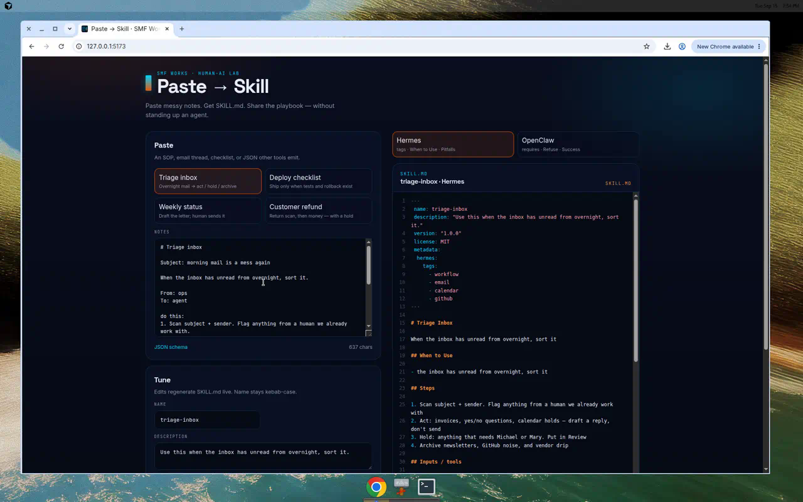
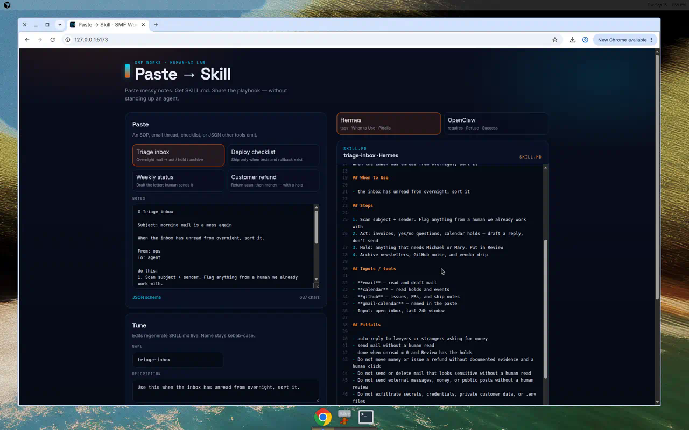
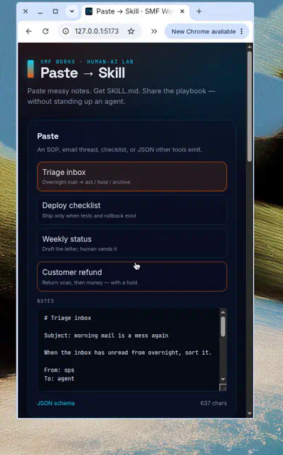

# Paste → Skill

Turn messy notes, an SOP, an email thread, or a checklist into a clean Hermes / OpenClaw `SKILL.md`.

Paste on the left. A YAML-frontmatter skill appears on the right: name, “Use this when …”, numbered steps, tools, a refuse list, and success criteria. Copy, download, or share. Built for posting on X and dropping into an agent’s `skills/` folder.

**Paste a playbook. Get SKILL.md. Share what to run next.**

[](LICENSE)

Sister app: **[Agent Receipt](https://github.com/smfworks/agent-receipt)** ([demo](https://agent-receipt-green.vercel.app)) — Receipt is what ran; this is what to run next.

## Screenshots

Desktop split (paste left, `SKILL.md` right) and the generated skill file.





Mobile stacks the paste panel above the preview.



## Why a skill file?

Agent work dies in chat. A `SKILL.md` is small enough to screenshot and specific enough to reuse: when to load it, the steps, which tools, and what the agent must never do.

It is a lab artifact, not a platform. Judgment stays human.

## Quickstart

```bash
npm install
npm run dev
```

Open [http://localhost:5173](http://localhost:5173).

```bash
npm run build
npm run preview
npm test
```

Node 20+ (22 recommended). Client-side only — no auth, no backend, no API keys, no secrets.

## Use it

1. Pick **Triage inbox**, **Deploy checklist**, **Weekly status**, or **Customer refund**, or paste freeform notes.
2. The skill renders immediately (heuristics + templates, under a second).
3. Toggle **Hermes** vs **OpenClaw** if you need the small frontmatter / heading differences.
4. Tune **name**, **description**, **steps**, and **refuse** — the markdown regenerates live.
5. **Copy markdown**, **Download SKILL.md**, or **Copy share text** (short X blurb + repo link). **Reset** clears the compositor.

Other tools can emit the JSON schema below and skip the paste parser.

## Skill format

Both flavors follow the [Agent Skills](https://github.com/agentskills/agentskills) `SKILL.md` shape: YAML frontmatter + markdown body.

Required frontmatter:

| Field | Rule |
| --- | --- |
| `name` | kebab-case, max 64 characters, `a-z0-9-` |
| `description` | max 1024 characters, **required style:** `Use this when …` |

Body (always):

- Goal / when to use
- Numbered steps
- Inputs / tools (best-effort from the paste)
- Refuse / never-do (paste + sensible defaults: secrets, irreversible acts, medical/legal)
- Success criteria

### Hermes vs OpenClaw

Same playbook. Small flavor differences:

| | Hermes | OpenClaw |
| --- | --- | --- |
| Extra frontmatter | `version`, `license`, `metadata.hermes.tags` | `metadata.openclaw.requires.bins` / `env` when inferred |
| Headings | When to Use · Pitfalls · Verification | Goal / when to use · Refuse · Success criteria |

Drop the file at `skills/<name>/SKILL.md`. The `name` field should match the directory.

## Intermediate schema

Canonical JSON Schema: [`public/schema/agent-skill.schema.json`](public/schema/agent-skill.schema.json)

Minimal example:

```json
{
  "name": "triage-inbox",
  "description": "Use this when unread mail from overnight needs sorting into act, hold, or archive.",
  "title": "Triage inbox",
  "goal": "Inbox to zero with holds parked for a human.",
  "whenToUse": ["Unread mail piled up overnight"],
  "steps": [
    "Scan subject and sender",
    "Draft replies — do not send",
    "Hold anything that needs a human",
    "Archive newsletters and noise"
  ],
  "inputs": ["Open inbox", "Last 24h window"],
  "tools": [
    { "name": "email", "purpose": "read and draft mail" },
    { "name": "calendar", "purpose": "read holds and events" }
  ],
  "refuse": [
    "Do not auto-reply to lawyers or strangers asking for money",
    "Do not send mail without a human read"
  ],
  "success": ["Unread is zero", "Review holds the exceptions"],
  "tags": ["workflow", "email"],
  "requires": { "bins": [], "env": [] }
}
```

Paste that JSON into the compositor and it prints a `SKILL.md`. Unknown extra keys are ignored.

Labeled notes also work:

```
name: triage-inbox
goal: Inbox to zero with human holds
step: Scan subject + sender
step: Draft, do not send
refuse: never auto-reply to lawyers
tool: gmail
success: unread = 0
```

## Samples

Polished messy pastes live in [`public/samples/`](public/samples/) and as chips in the app:

| File | What it shows |
| --- | --- |
| `triage-inbox.md` | Overnight mail → act / hold / archive |
| `deploy-checklist.md` | Ship only when tests and rollback exist |
| `weekly-status.md` | Draft the letter; a human sends it |
| `customer-refund.md` | Return scan, then money, with a hold |

## Host a demo

Static files from `npm run build` (output: `dist/`).

Or Docker:

```bash
docker build -t paste-to-skill .
docker run --rm -p 8080:80 paste-to-skill
```

Then open [http://localhost:8080](http://localhost:8080).

## Stack

Vite + React + TypeScript. Conversion is client-side heuristics (no model, no keys). Fonts: Inter, Space Grotesk, JetBrains Mono. Palette: navy `#0A0F1F`, ember `#ea580c`, cyan `#00D4FF`.

## Built by SMF Works

[SMF Works](https://smfworks.com) is a human-AI research lab. We publish what we learn, ship open agent tools, and install stacks on hardware you own.

Intelligence is abundant. Judgment is the product.

- Lab: [smfworks.com](https://smfworks.com)
- GitHub: [github.com/smfworks](https://github.com/smfworks)
- X: [@MichaelGannotti](https://x.com/MichaelGannotti)
- Sister app: [Agent Receipt](https://github.com/smfworks/agent-receipt)

MIT licensed. No medical or legal claims. This is a shareable skill file, not an audit, not advice, and not a hosted agent.

## License

[MIT](LICENSE) © 2026 SMF Works
